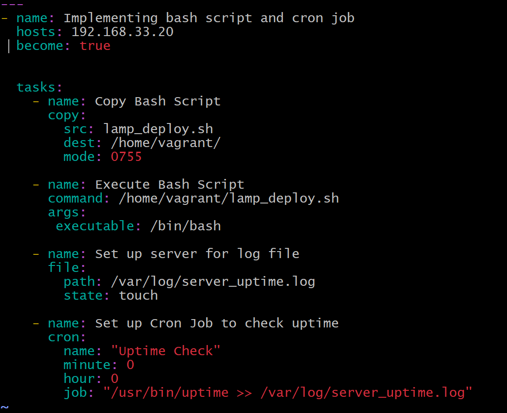
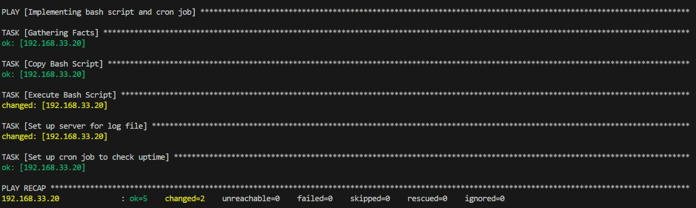

# Objective

- Automate the provisioning of two Ubuntu-based servers, named “Master” and “Slave”, using Vagrant.
- On the Master node, create a bash script to automate the deployment of a LAMP (Linux, Apache, MySQL, PHP) stack.
- This script should clone a PHP application from GitHub, install all necessary packages, and configure Apache web server and MySQL. 
- Ensure the bash script is reusable and readable.

**Using an Ansible playbook:**

- Execute the bash script on the Slave node and verify that the PHP application is accessible through the VM’s IP address (take screenshot of this as evidence)
- Create a cron job to check the server’s uptime every 12 am.


**PHP Laravel GitHub Repository:**

https://github.com/laravel/laravel

# PROJECT STEPS :-

- It is important first of all to configure your Master Ubuntu-based Servers. Install your virtual machine and run the command, ```vagrant init ubuntu/focal64```. But before you do a ```vagrant up```, open the configuration file, ```vim Vagrantfile``` and make sure to configure the uncommented parts of this vagrantfile as seen below;


- Then configure your Slave Ubuntu Server in the same as you did for the Master.


*This is a sample to create a BashScript file that will automate LANP Stack and deploy them on the slave server*
```
#!/bin/bash

# Updating slave instance
sudo apt update
echo "Slave ubuntu apache instance completed #################"

# Installing apache server
sudo apt install apache2 -y
echo "Apache server succesfully installed #############"

# Installing mySQL server
sudo apt install mysql-server -y
echo "Mysql Server installed completely ###################"

# Adding php repositoires
yes | sudo add-apt-repository ppa:ondrej/php
echo "Repositories completely added ############"

# Updating repositories files added from the php repo
sudo apt update
echo "Packages successfilly updated.........."

# Installing php and extensions
sudo apt install php libapache2-mod-php php-mysql php8.3 php8.3-curl php8.3-dom php8.3-mbstring php8.3-xm
l php8.3-mysql php8.3-sqlite3
echo "PHP repo and extension successfully installed......."


# Installling zip and unzip packages
sudo apt install zip unzip -y
echo "Packages installed successfully"

# Uninstalling old php packages
sudo apt purge php7.4 php7.4-common -y
echo "PHP old version uninstalled........."

# Upadating packages
sudo apt-get update
echo "Packages fully updated......."

# Installing git on slave ubuntu instances
sudo apt install git -y
echo "Git successfully installed"

# Enabling url
sudo a2enmod rewrite
sudo a2enmod php8.3


sudo service apache2 restart
echo "Apache server successfully restarted........"

# Creating database, user and granting priviledges
MYSQL_COMMANDS=$(cat <<EOF
CREATE USER 'debby'@'localhost' IDENTIFIED BY '090381759';
CREATE DATABASE lampstackdb;
GRANT ALL PRIVILEGES ON lampstackdb . * TO 'debby'@'localhost';
FLUSH PRIVILEGES;
EOF
)
echo "$MYSQL_COMMANDS" | sudo mysql -u root
echo "Database succesfully created and privilegdes granted"

# Installing composer inside cd/usr/bin
cd /usr/bin

# Downloading composer and renaming composer file inside binary directory
curl -sS https://getcomposer.org/installer | sudo php
sudo mv composer.phar composer

# changing to /var/www directory to clone laravel application project from git hub
cd /var/www/
sudo git clone https://github.com/laravel/laravel.git
echo "cloning completed........."

# changing into the laravel directory and installing composer autoloader
cd laravel
composer install --optimize-autoloader --no-dev
echo "Composer dependencies installed................."
yes | sudo composer update

# Copying content of .env.example into .env
sudo cp .env.example .env
echo "Completed............."

# Configuring the database config in the .env file
DB_HOST="localhost"
DB_DATABASE="lampstackdb"
DB_USERNAME="debby"
DB_PASSWORD="090381759"

# Set the path to your .env file
file="/var/www/laravel/.env"

# editing the .env file
sed -i "s/DB_HOST=.*/DB_HOST=${DB_HOST}/" ${file}
sed -i "s/DB_DATABASE=.*/DB_DATABASE=${DB_DATABASE}/" ${file}
sed -i "s/DB_USERNAME=.*/DB_USERNAME=${DB_USERNAME}/" ${file}
sed -i "s/DB_PASSWORD=.*/DB_PASSWORD=${DB_PASSWORD}/" ${file}

# Generating KEY_FILE
sudo php artisan key:generate
echo "Key file generated..............."

# Grepping user data to change ownership of storage/bootstrap/cache
ps aux | grep "apache" | awk '{print $1}' | grep -v root | head -n 1
sudo chown -R www-data storage
sudo chown -R www-data bootstrap/cache
echo "Process completed ........................."

# changing directory into sites-available
cd /etc/apache2/sites-available/

# copying the 000-default cfg into laravel cfg
sudo cp 0000-default laravel.conf

# changing laravel cfg file ownership to vagrant user:group
sudo chown vagrant:vagrant laravel.conf


# modifying the laravel to write permission
chmod +w laravel.conf

# modifting the file pointing to the laravel landing page which is public dir (index.php) and serverName
sudo cat<<EOF >laravel.conf
<VirtualHost *:80>
ServerName 192.168.33.20
DocumentRoot /var/www/laravel/public

    <Directory /var/www/laravel/public>
        Options Indexes FollowSymLinks
        AllowOverride All
        Require all granted
    </Directory>

    ErrorLog ${APACHE_LOG_DIR}/laravel-error.log
    CustomLog ${APACHE_LOG_DIR}/laravel-access.log combined

</VirtualHost>
EOF

# Disable 000-default.conf
sudo a2dissite 000-default.conf

# enabling laravel.conf
sudo a2ensite laravel.conf

# Validating syntax error
apache2ctl -t

sudo touch /var/www/laravel/database/database.sqlite
sudo chown www-data:www-data /var/www/laravel/database/database.sqlite
cd /var/www/laravel/

# Using php artisan to migrate all cfg files and database
sudo php artisan migrate
sudo php artisan db:seed

# Restarting Apache to spring up laravel application landing page
sudo systemctl restart apache2

```

1. Go to your web browser, input the ip address of your master node and you should be greeted with the laravel homepage interface below;


2. Go to your web browser, input the ip address of your slave node and you should be greeted with the laravel homepage interface below;


3. Then create your playbook that will be used to execute your bashscript on the slave server. Run the playbook with the command; ```ansible-playbook -i host playbook.yaml```. Always replace the 'host' with whatever title you gave to your inventory file. Below this is screen of the successful running of the playbook..



readme.md
Displaying readme.md.